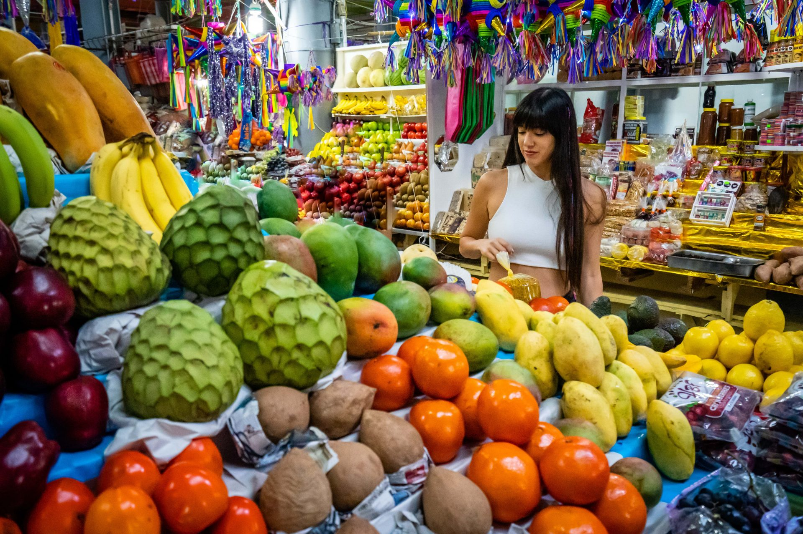
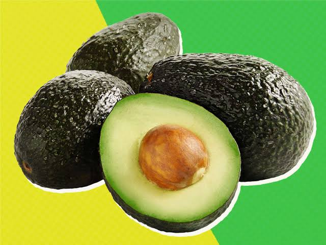
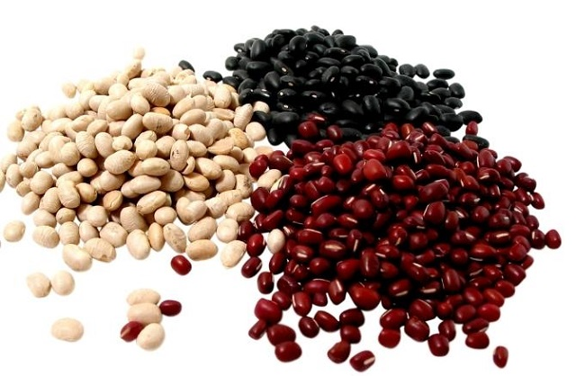

# Monse's Super Carniceria #1

## Overall description of project

HTML, CSS and Bootstrap are the foundation of this e-commerce website. I created an online carniceria which translates to 'butcher shop'. The 'Super' in the title is intended to imply that it is more than a carniceria, as is the case for the majority of these kinds of stores in the US. They are targeted to the Hispanic/Latino community and usually offer products from Mexico and other Latin American countries.

My website has a navbar located at the top of each page and remains consistent throughout. The background is the same light green on each page. It also features 5 pages and is simple in its layout thus making it easy to navigate:

Index/Home page: a 'Welcome!' heading greets you as your eyes draw attention to an image that features a person shopping in a traditional carniceria. There is a small paragraph centered underneath that describes the store and an example of what is offered in a bullet point list.

Products page: 6 products are displayed on this page, 3 products per row and 2 per column. Each image was resized in Paint to 1000px horizontally for consistency. The name of the product and its price is clearly displayed within the products cards in addition to a 'Add to Cart' button.

Create Account page: a 'Username', 'Email address', 'Password', and 'Confirm password' field is displayed on this page including an option that prompts you with the question 'How did you hear about us?'. Underneath it, you may select one option and then create your account.

Login page: a 'Username' and 'Password' field is displayed on this page along with an option to 'Remember me' that is easy to select/de-select.

Checkout page: to the far left is the 'Billing Address' information where you can type in your 'Full Name', 'Email', 'Address', 'City', 'State', and 'Zip' in its respective fields. Directly underneath it you can select/de-select the checkbox next to 'Shipping address same as billing'. To the right of this is the 'Payment' information where you can type in the 'Name on Card', 'Credit card number', 'Exp Month', 'Exp Year' and 'CVV'. Underneath this, you will find a 'Continue to checkout' button. To the far right, you will see an example of what a 'Cart' looks with 3 products displaying their price, the amount of items in the 'Cart' and the total.

## Images of the site's page

 

## Describe one piece of code

I initially inserted the products in one after another which caused them to stack on top of each other. To achieve the 2 rows that I was aiming for, I simply seperated the 3 products into their own div class.